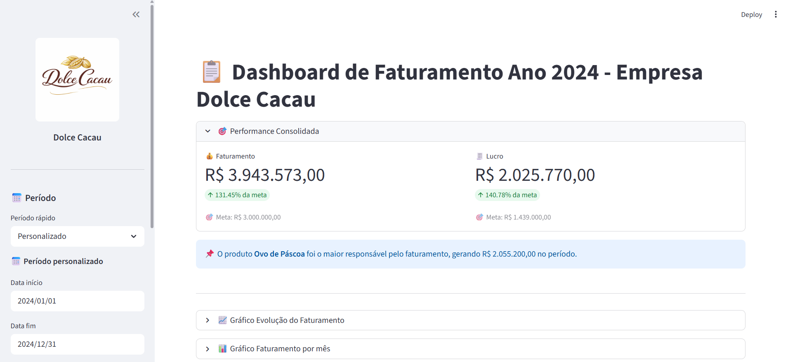

# 🍫 Dashboard de Faturamento - Dolce Cacau

Dashboard interativo desenvolvido com **Streamlit** para análise de faturamento, lucro e desempenho de vendas, simulando um cenário real de negócio.

---

## 📊 Funcionalidades

- 📅 Filtro por período (rápido + personalizado)
- 📦 Filtro por produto e categoria
- 💰 KPIs principais (Faturamento e Lucro)
- 📈 Evolução do faturamento ao longo do tempo
- 📊 Resumo mensal
- 🧠 Insight automático (produto mais lucrativo)
- 📥 Exportação de dados filtrados

---

## 🛠️ Tecnologias Utilizadas

- **Python** → linguagem principal para análise de dados  
- **Pandas** → manipulação e transformação de dados  
- **Plotly** → criação de gráficos interativos  
- **Streamlit** → desenvolvimento do dashboard interativo  
- **Jupyter Notebook** → análise exploratória de dados (EDA)  

---

## 📈 Principais Insights

- Identificação dos produtos mais lucrativos  
- Impacto da sazonalidade (Páscoa e Natal)  
- Evolução do faturamento ao longo do tempo  
- Relação entre faturamento e margem  

---

## 🖼️ Preview



---

## 📂 Estrutura do projeto

```
ANALISE_DADOS_PANDAS/
│
├── data/
│   └── vendas.csv
│
├── assets/
│   └── logo.png
│
├── notebooks/
│   └── analise_vendas.ipynb
│
├── src/
│   └── gerar_dados.py
│
├── controle_vendas.py
├── requirements.txt
├── README.md
├── LICENSE
└── .gitignore